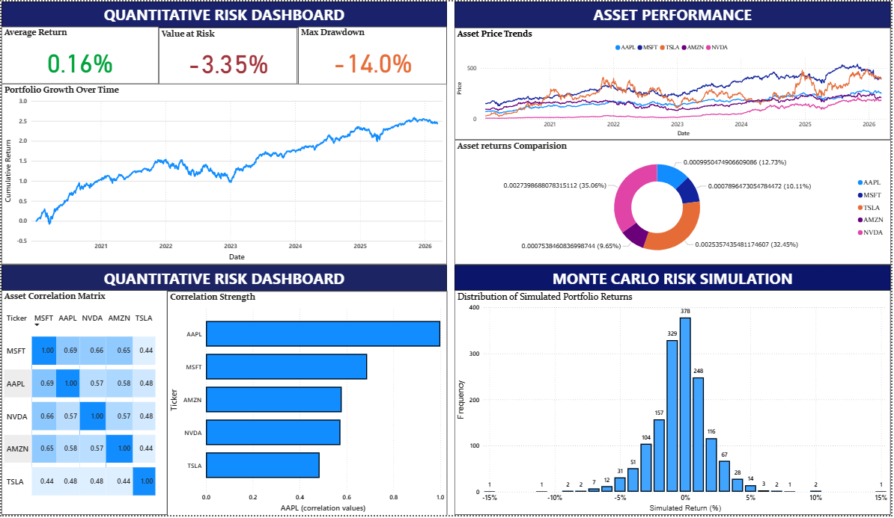

# Quantitative-Risk-Dashboard
 
QUANTITATIVE RISK DASHBOARD

Overview

This project analyzes financial market data and measures portfolio risk using quantitative methods.
The analysis was performed using Python, and the results were visualized using Microsoft Power BI.
The goal of this project is to understand how different assets behave together and to evaluate the risk of a portfolio.

---

Tools Used.

- Python
- Pandas & NumPy
- Jupyter Notebook
- Microsoft Power BI
- Microsoft Excel 

---

Assets Analyzed

- AAPL (Apple)
- MSFT (Microsoft)
- TSLA (Tesla)
- AMZN (Amazon)
- NVDA (Nvidia)

Market data was downloaded using the yfinance library starting from 2020.

---

Risk Metrics Calculated

- Portfolio Returns
- Portfolio Volatility
- Value at Risk (VaR)
- Sharpe Ratio
- Correlation Between Assets

---

Dashboard Pages

The Power BI dashboard contains four pages:

1. Risk Overview – Key portfolio risk metrics
2. Portfolio Performance – Portfolio return trend
3. Market Trends – Stock price movements
4. Correlation Analysis – Relationship between assets

---

## Dashboard Preview

